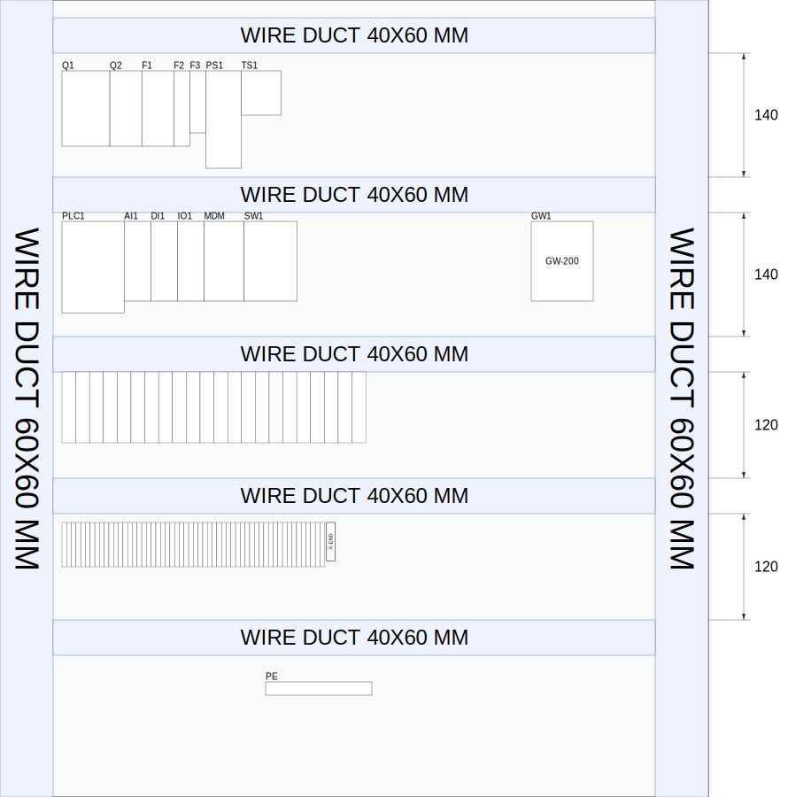
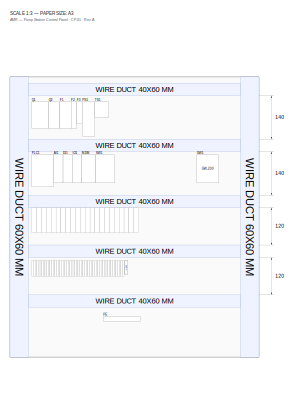
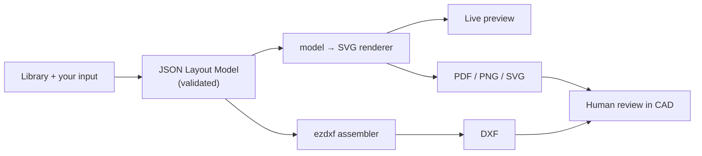

<h1 align="center">Cabinet Layout Generator</h1>

<p align="center">
  <strong>Lay out a control-cabinet back-plate in the browser — and export a real DXF that opens in GstarCAD.</strong>
</p>

<p align="center">
  Drag real DIN-rail parts, wire ducts, terminal sets and labels onto a mounting plate, set exact
  spacing in millimetres, and generate fabrication-ready <b>DXF</b> · <b>PDF</b> · <b>PNG</b> · <b>SVG</b>.
</p>

<p align="center">
  
  &nbsp;&nbsp;&nbsp;
  
</p>

<p align="center">
  <sub><em>Left: the live editor drawing. Right: the same model exported to an A3 sheet with title line, scale and row
  dimensions. Both are rendered from <b>one JSON model</b> — no redrawing.</em></sub>
</p>

<p align="center">
  
  
  
  
</p>

---

## Why it's different

Most "AI CAD" tools guess. This one doesn't.

> **The tool never invents geometry, connectivity, or part data. It only structures and interprets your
> input. Deterministic code draws every line. A human reviews the result in CAD.**

Every dimension, position and part identity is *exactly* what your validated input says — never a model's
best guess, because a confidently-wrong terminal or clearance ships to a panel shop. Unknown values are
**flagged for human confirmation**, never silently filled. (AI is socketed but **off** in v1; when enabled
it only ever structures messy input into the validated schema — it never emits a coordinate.)

---

## What you can do

**Place & arrange**
- Drag/drop parts from a seeded library — PLCs, IO modules, breakers, relays, terminals, ground bars…
- Resize equipment only by **typed millimetres**, never by free-drag (a real panel part has one true size)
- Rotate 0 / 90 / 180 / 270° or arbitrary; spacing math uses the rotated bounding box
- Snap to the **DIN-rail centerline**, to a neighbour with the 0.1 mm gap, or to a 1 mm grid
- Multi-select (Shift-click), nudge with arrow keys, full undo / redo

**Wire ducts**
- Side ducts + row ducts; drag a duct to snap it **exactly onto any of the 4 plate borders**
- Row ducts **auto-span between the side ducts** on creation — no hand-measuring; one click **Fit width** re-spans

**Terminal accessories & custom parts**
- **Stopper** and **Stopper with Label** — the stopper and its centered-marker label **move, rotate and delete as a locked pair**, while staying two parts so the BOM counts 1 stopper + 1 label
- **Custom part** — a blank device you **size and name yourself** (model/part-no centered inside, auto-fit so it never overflows; tag above in plain sight), for any part you don't have a CAD file for yet

**Rows**
- Rows are auto-detected between ducts, with each row height **dimensioned in the right margin**
- Click a row dimension to edit its height; **Pack** a row from the left duct; **center** its devices vertically

**Validate — never silently coerce**
- Overlap, too-tight clearance and plate-overflow are **flagged with a human-readable message**, never auto-cropped

**Export — all from the one model**
- **DXF** with layers `DUCT` / `EQUIP` / `TEXT` / `GROUND`, at 1:1 or 1:100, monochrome so it prints black in CAD — every part is placed as a **named block** (`EQ_<key>`) so CAD **Count Block** / a future BOM can tally it
- **PDF / PNG / SVG** in the browser, auto-fit to A4 / A3 with the resulting scale printed in the title line
- **Upload your own equipment DXF** to add a measured part to the library

---

## How it works

One JSON model is the single source of truth. The canvas is only a view — every export re-renders from the
model, so what you see is what you get.



- **One renderer** (`model → SVG`) feeds the live preview *and* the PDF/PNG/SVG exports — they can't drift apart.
- **One coordinate transform** converts the editor's top-left origin to DXF's bottom-left, in a single place.
- **Pure, unit-tested core** — re-flow, packing, bbox/rotation math and the transform have no UI dependency.

---

## Quick start (local)

```bash
# 1) the editor — everything except DXF works with no backend
cd web
npm install
npm run dev            # → http://localhost:5180

# 2) optional: the DXF upload/export service (only needed for DXF)
cd service
python -m venv .venv
.venv\Scripts\activate          # Windows  (use: source .venv/bin/activate on macOS/Linux)
pip install -r requirements.txt
uvicorn app:app --port 8000
```

Full instructions: **[RUNNING.md](RUNNING.md)** · deploy to Vercel + Render: **[DEPLOY.md](DEPLOY.md)**.

**New to the editor?** Once it's running, click **? Guide** in the toolbar (or open `/guide.html`) for an
illustrated walkthrough of every feature.

---

## Tech stack

- **Editor** — React 19 + Vite + TypeScript, Fabric.js v7 canvas, Vitest for the pure core
- **DXF service** — Python + FastAPI + ezdxf, stateless with just two endpoints (`upload`, `export`)
- **Free & portable on every layer** — layouts persist as JSON, equipment as raw DXF; nothing traps the engineer if a free tier changes

## Project layout

```
web/        React (Vite) editor — the model, validation, the model→SVG renderer, the canvas UI
  src/model/    types, geometry, library seed, validate, reflow, packing   (pure, unit-tested)
  src/render/   toSvg + page composer — THE single renderer (preview + PDF/PNG/SVG)
  src/editor/   Fabric.js canvas view binding
service/    Python ezdxf service — DXF upload (→ SVG + bbox + block) and export (→ .dxf)
shared/     JSON schema + library seed shared by both tiers
docs/       showcase drawings used in this README (generated from the model)
```

## Status

**Phase 1 — complete.** Single-user editor (drag/drop, move/rotate/type-mm, sets, labels, ducts with
border-snap + auto-span, rows with dimensions, packing, zoom/pan, overlap + clearance warnings),
stopper/label locked pairs, user-defined custom parts, equipment DXF upload, and all four exports
(DXF via the service — every part a named block; PDF/PNG/SVG in-browser).

**Next — Phase 2:** Supabase auth + shared projects/library, then move hosting to Cloudflare. The AI
socket stays off until then.

---

<p align="center"><sub>Built for AMR Asia panel-shop drawings. The showcase images above are real tool output, rendered straight from the JSON model.</sub></p>
